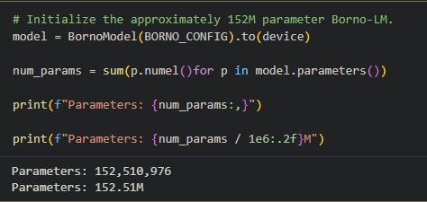
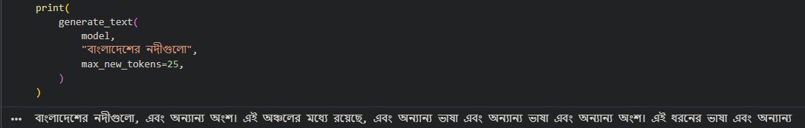

# Borno-LM

Borno-LM is an experimental, decoder-only language model for Bangla. It is implemented in PyTorch in a Jupyter notebook and trained with causal next-token prediction. The current notebook builds a SentencePiece tokenizer, streams a small Bangla text corpus, pretrains the model, saves checkpoints, and generates text.

> **Research prototype:** the notebook's initial experiment uses only about two million corpus characters. The model size is not a measure of training-data scale or output quality; treat generated text as experimental.

## Architecture

| Component | Configuration |
| --- | --- |
| Model type | Decoder-only Transformer (GPT-style) |
| Trainable parameters | **152,510,976** (~152.51 M) |
| Maximum context length | 512 tokens |
| Token embedding dimension | 768 |
| Attention heads | 12 (`head_dim = 768 / 12 = 64`) |
| Transformer blocks | 18 |
| Feed-forward network | 768 → 3,072 → 768, with GELU |
| Normalization | Pre-norm LayerNorm, plus a final LayerNorm |
| Attention | Causal multi-head self-attention with an upper-triangular future-token mask |
| Tokenizer | SentencePiece BPE, 16,000 pieces |
| Output head | Separate linear projection to the vocabulary, **without bias** |

Each block applies pre-normalized self-attention and a pre-normalized feed-forward network with residual connections. The model adds learned token and position embeddings; the output projection is not tied to the token embedding matrix.

### Parameter-count calculation

Let the vocabulary size be \(V=16{,}000\), the embedding width be \(d=768\), the feed-forward width be \(4d=3{,}072\), and the number of blocks be \(L=18\). The count below includes trainable weights and biases, but excludes dropout and the causal mask because neither has trainable parameters.

**Per Transformer block**

| Submodule | Calculation | Parameters |
| --- | --- | ---: |
| Q, K, V projections | \(3 \times d \times d\), no biases | 1,769,472 |
| Attention output projection | \(d \times d + d\) bias | 590,592 |
| Feed-forward layers | \((d \times 4d + 4d) + (4d \times d + d)\) | 4,722,432 |
| Two LayerNorms | \(2 \times (d\text{ scale} + d\text{ shift})\) | 3,072 |
| **One block** | Sum of the submodules above | **7,085,568** |
| **18 blocks** | \(18 \times 7{,}085{,}568\) | **127,540,224** |

**Embedding, final normalization, and output**

| Component | Calculation | Parameters |
| --- | --- | ---: |
| Token embeddings | \(V \times d = 16{,}000 \times 768\) | 12,288,000 |
| Learned position embeddings | \(512 \times d\) | 393,216 |
| Final LayerNorm | \(d\) scale + \(d\) shift | 1,536 |
| Output projection | \(d \times V = 768 \times 16{,}000\), no bias | 12,288,000 |
| **Embedding/output subtotal** | Sum of the components above | **24,970,752** |

Therefore:

```text
18 Transformer blocks     127,540,224
Token + position embeddings 12,681,216
Final LayerNorm                  1,536
Output projection           12,288,000
                            ----------
Total                      152,510,976 parameters
```

The exact number is also computed in the notebook by summing `p.numel()` for every parameter in the instantiated PyTorch model.



*Parameter count reported by the notebook.*

## Training workflow

The training pipeline is in [`src/pretraining.ipynb`](src/pretraining.ipynb). In its current form, it:

1. Loads the `bangla_corpus` split of [`ahmed-farhanur-rashid/bn-foundational-pretrain-corpus`](https://huggingface.co/datasets/ahmed-farhanur-rashid/bn-foundational-pretrain-corpus) in streaming mode and collects approximately two million characters.
2. Splits that text sequentially into 90% training and 10% validation portions.
3. Trains a 16,000-piece SentencePiece BPE tokenizer (`character_coverage=0.9995`) on the collected corpus, then encodes the train and validation portions.
4. Creates non-overlapping 512-token input windows and one-token-shifted next-token targets.
5. Trains for five epochs with batch size 2, AdamW (learning rate `1e-4`, weight decay `0.1`), and gradient clipping at `1.0`.
6. Reports cross-entropy loss and perplexity and saves latest and best-validation checkpoints.

The notebook selects CUDA when available and otherwise uses CPU. A GPU is strongly recommended for practical training of this model. The configuration and data scale are intended for an initial experiment, not a claim of broad Bangla coverage.

The validation portion is the final 10% of the collected text rather than a randomized or document-level holdout. Since the tokenizer is fitted on the complete collected corpus before the two portions are encoded, its vocabulary has also seen text from the validation portion.

## Run the notebook

The notebook is currently configured for **Google Colab**: it includes Colab-specific setup, mounts Google Drive, and writes data, tokenizer files, and checkpoints beneath `MyDrive/borno-lm`.

1. Open [`src/pretraining.ipynb`](src/pretraining.ipynb) in Google Colab (the notebook also has an **Open in Colab** badge).
2. Select a GPU runtime if available.
3. Run the cells from top to bottom. Approve the Google Drive mount when prompted.
4. The notebook installs `sentencepiece` and `datasets`; the runtime also needs PyTorch, NumPy, Matplotlib, and `tqdm`.

The notebook reads its training corpus from the Hugging Face dataset and writes a generated `bangla_corpus.txt` to its Drive data directory. The repository also contains [`data/raw/bangla_corpus.txt`](data/raw/bangla_corpus.txt), but the notebook does not currently use that local file as its corpus input.

### Running outside Colab

The notebook is not currently a standalone local training script: its Google Drive mount and `/content/drive/...` paths are Colab-specific. To run it locally, install the notebook dependencies, remove or replace the Colab Drive-mount cell, and update `ROOT_DIR` to a writable local directory before running the remaining cells. No dependency lockfile or automated training CLI is provided yet.

## Text generation

After training, the final notebook cell defines `generate_text(model, prompt, max_new_tokens=100, context_size=512)`. It encodes a Bangla prompt with the trained tokenizer, repeatedly predicts the highest-logit next token (greedy decoding), and decodes the resulting sequence. It uses the in-memory model and tokenizer from the current notebook session; it does not currently provide a standalone checkpoint-loading inference command.



*Example output from greedy text generation in the notebook.*

## Repository layout

```text
.
├── data/
│   └── raw/
│       └── bangla_corpus.txt
├── src/
│   ├── pretraining.ipynb       # Tokenizer, model, training, and generation workflow
│   └── wikipedia_extraction.py # Small Bangla Wikipedia article text extractor
├── LICENSE
└── README.md
```

`src/wikipedia_extraction.py` fetches the Bangla Wikipedia article “বাংলাদেশ” using the MediaWiki API and writes cleaned text to `data/raw/wikipedia/bangladesh.txt`. It is a separate utility; the current pretraining notebook uses the Hugging Face corpus instead.

## License

This project is released under the [MIT License](LICENSE).
